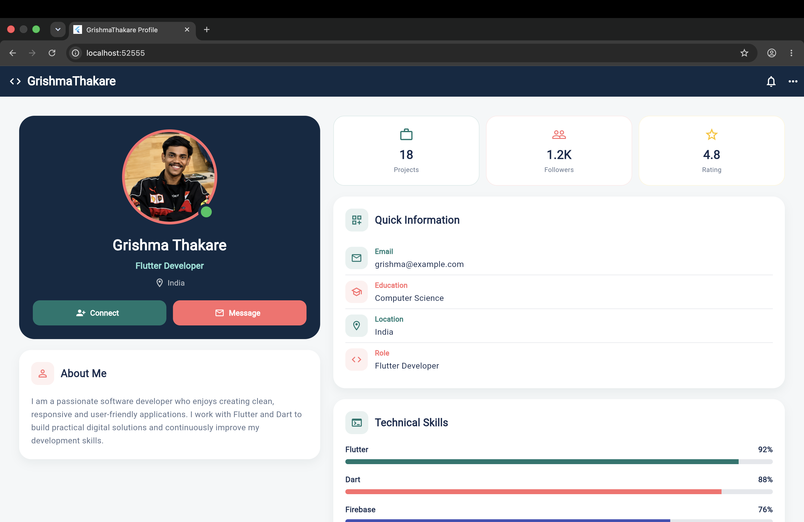

# ✨ GrishmaThakare Profile Card

<div align="center">

## 💻 A Modern Flutter Profile Card

A clean, responsive and modern developer profile card built using **Flutter & Dart**.



### 🚀 Simple. Modern. Responsive.

</div>

---

## 📌 About The Project

This project is a **responsive personal profile card application** created using Flutter.

The design presents a developer profile in a modern dashboard-style layout with:

- 👤 Profile information
- 📊 Project and follower statistics
- 📝 About Me section
- 📧 Contact information
- 🎓 Education details
- 💻 Technical skills
- 📈 Skill progress indicators
- 📱 Responsive mobile layout
- 🖥️ Responsive desktop layout

The main goal of this project is to practice **Flutter UI development, layouts, widgets and responsive design**.

---

## 🎨 Project Preview

<div align="center">


</div>

---

## 🌟 Features

### 👤 Profile Section

- Profile picture with circular design
- Online status indicator
- Developer role
- Location information
- Connect button
- Message button

### 📊 Statistics

The dashboard displays:

| Statistic | Value |
|-----------|-------|
| 💼 Projects | 18 |
| 👥 Followers | 1.2K |
| ⭐ Rating | 4.8 |

### 📝 About Me

A short developer introduction with a clean card-based design.

### 📋 Quick Information

Includes:

- 📧 Email
- 🎓 Education
- 📍 Location
- 💻 Developer Role

### 💻 Technical Skills

The application displays skill levels using progress indicators:

- Flutter — 92%
- Dart — 88%
- Firebase — 76%
- UI / UX — 82%

---

## 🎨 Color Theme

The project uses a different color palette instead of the traditional pink profile-card design.

| Color | Purpose |
|-------|---------|
| 🔵 Navy | Main background and header |
| 🟢 Teal | Primary accent |
| 🔴 Coral | Secondary accent |
| ⚪ White | Cards and content |
| 🌫️ Light Grey | Page background |

---

## 📱 Responsive Design

The application automatically changes its layout according to the screen size.

### 🖥️ Desktop

The profile is divided into two main sections:

```text
┌──────────────────────┬──────────────────────────────┐
│                      │                              │
│   Profile Card       │      Statistics              │
│                      │                              │
│   About Me           │      Quick Information       │
│                      │                              │
│                      │      Technical Skills        │
│                      │                              │
└──────────────────────┴──────────────────────────────┘