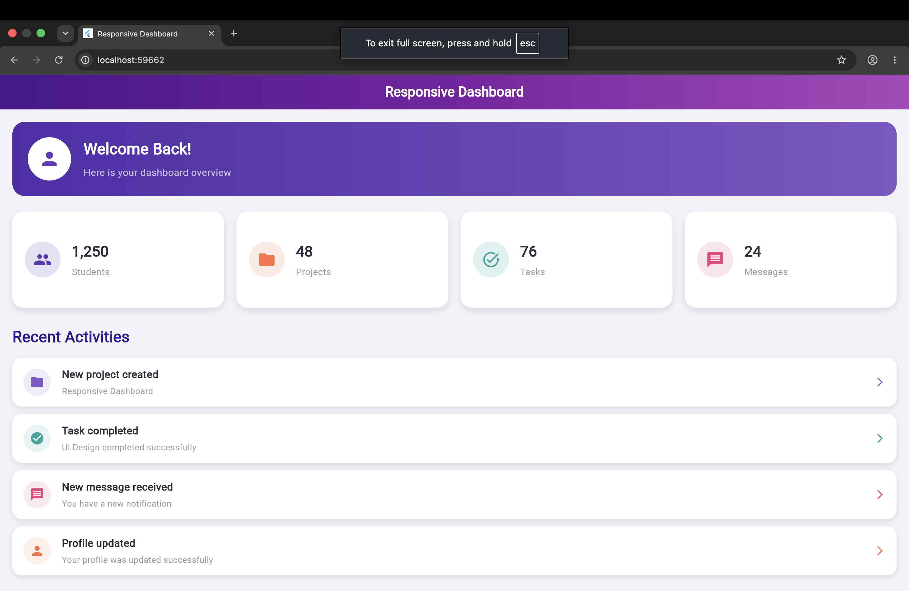
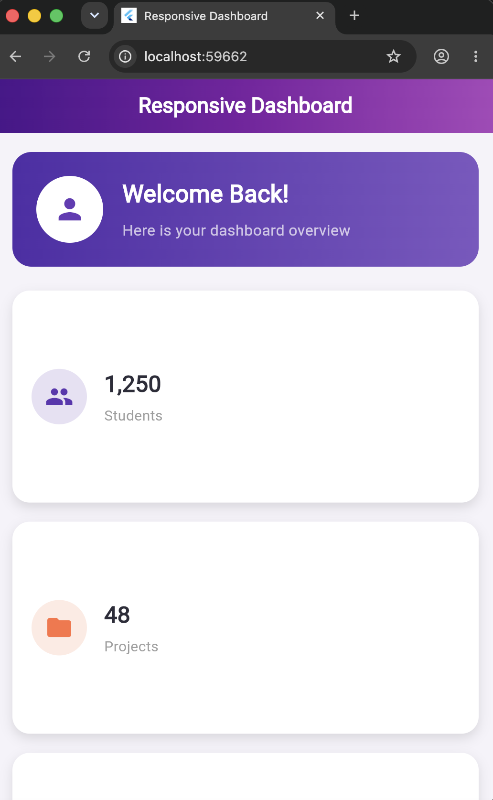
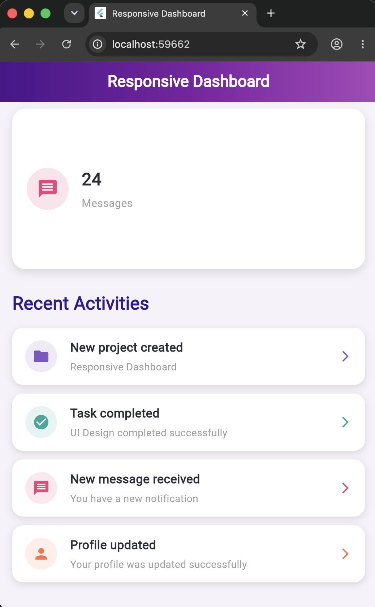

# 📊 Responsive Dashboard UI

A responsive multi-section Dashboard UI built using **Flutter**. This project demonstrates how a Flutter application can adapt its layout according to different screen sizes such as **Desktop, Tablet, and Mobile**.

The dashboard contains a welcome section, statistics cards, and a recent activities section. Different Flutter layout widgets such as `GridView`, `ListView`, `Expanded`, `Flexible`, and `MediaQuery` are used to create a responsive and structured user interface.

---

# 📌 Assignment Objective

The objective of this assignment was to create a **Responsive Dashboard UI using Flutter**.

The application should:

- Create a responsive dashboard layout.
- Display different statistics using cards.
- Display recent activities.
- Adjust the layout according to different screen sizes.
- Use Flutter layout widgets effectively.
- Organize the project into multiple reusable widgets.
- Maintain a clean and structured project architecture.

---

# ✨ Features Implemented

## 👋 Welcome Dashboard Header

A welcome section is displayed at the top of the dashboard.

It contains:

- User icon
- Welcome message
- Dashboard overview text
- Responsive layout

Example:

> Welcome Back!  
> Here is your dashboard overview

---

## 📊 Statistics Cards

The dashboard displays four statistics cards:

| Statistic | Value |
|-----------|-------|
| 👥 Students | 1,250 |
| 📁 Projects | 48 |
| ✅ Tasks | 76 |
| 💬 Messages | 24 |

The cards automatically adjust according to the screen size.

### Desktop

All four cards are displayed in a single row.

### Tablet

The cards are displayed in fewer columns depending on the available width.

### Mobile

The cards are displayed vertically in a single column for better readability.

---

## 📝 Recent Activities

The dashboard also displays recent activities.

Activities included:

- 📁 New project created
- ✅ Task completed
- 💬 New message received
- 👤 Profile updated

Each activity contains:

- Icon
- Activity title
- Description
- Arrow indicator

---

# 📱 Responsive Design

One of the main objectives of this project was to make the dashboard responsive.

The UI automatically changes according to the screen width.

The Flutter `MediaQuery` widget is used to detect the current screen size.

---

## 💻 Desktop View

For larger screens:

- Statistics cards are displayed in a row.
- Full dashboard layout is visible.
- More horizontal space is used efficiently.
- Activities are displayed in full width.

### Desktop Output



---

## 📱 Mobile View

For smaller screens:

- Statistics cards are displayed vertically.
- Content is easier to read.
- Layout adjusts automatically.
- Padding and spacing remain consistent.

### Mobile Output



---

## 📲 Tablet View

For medium-sized screens:

- Layout adjusts between desktop and mobile.
- Statistics cards use available screen space efficiently.
- Dashboard components remain properly aligned.

### Tablet Output



---

# 🛠️ Technologies Used

This project was developed using:

- Flutter
- Dart
- Material Design
- MediaQuery
- GridView
- ListView
- Expanded
- Flexible

---

# 🧩 Flutter Widgets Used

## MaterialApp

`MaterialApp` is used as the root widget of the application.

It provides:

- Application structure
- Theme support
- Navigation support
- Material Design widgets

---

## Scaffold

`Scaffold` provides the basic structure of the screen.

It is used to create:

- AppBar
- Body
- Screen layout

---

## AppBar

The AppBar is used to display the application title.

```dart
AppBar(
  title: const Text("Responsive Dashboard"),
)
